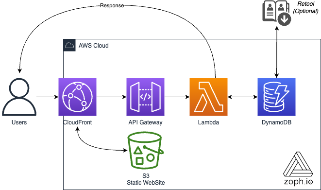
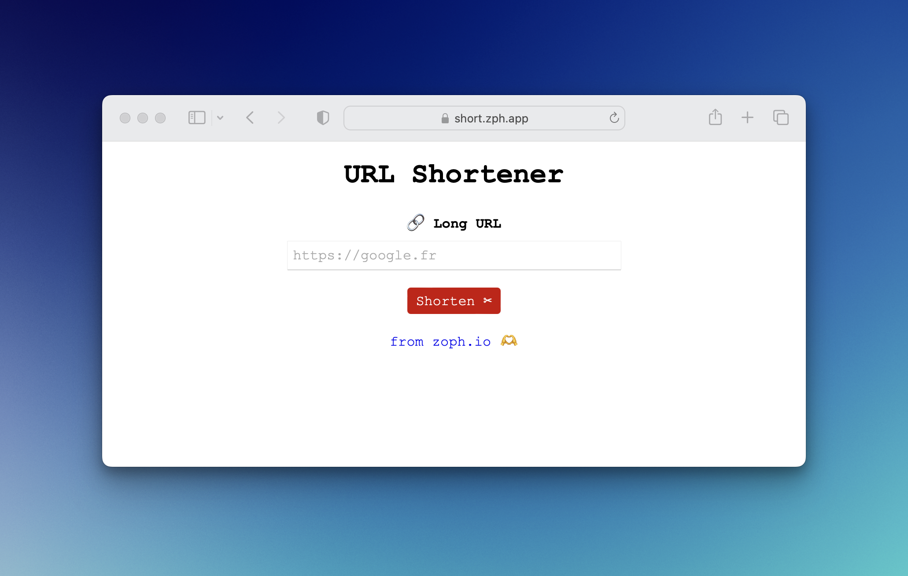

# 🔗 url-shortener

## 🧠 Rationale

This _yet another url-shortener_, is the one I'm using for [AWS Security Digest Newsletter](https://awssecuritydigest.com) to track click rate from my readers.

I wasn't able to find an existing solution that match my needs so I crafted my own version, another excuse to learn something new 🤓.

Try out this AWS serverless url-shortener for your own usage and see the benefits it can bring.

It's perfect for shortening links and tracking analytics.

Plus, contributions and pull requests are welcome.

## 💡 Features

1. `Create` API
2. Companion static website (HTML + Javascript)
   - [CORS](https://developer.mozilla.org/en-US/docs/Web/HTTP/CORS) and [CSP](https://developer.mozilla.org/en-US/docs/Web/HTTP/CSP) compliant
3. Hits counter + Analytics (Persisted in DynamoDB)

## 🔋 Powered by

- Lambda function (Python 🐍) + API Gateway
- CloudFront + S3 + ACM
- DynamoDB Table
- CloudFormation + SAM

## 📐 Schema



## 🚀 Usage

### Pre-requirements

1. You will need to have an already issued AWS Certificate Manage (ACM) wildcard Certificate in `us-east-1` AWS region: `*.{your_domain}`
2. Configure the proper parameters in the `Makefile` like the Route53 hosted zone Id (`HostedZoneId`)

#### 🎛 Parameters

| Parameters      | Default Value     | Description                                                     |
| --------------- | ----------------- | --------------------------------------------------------------- |
| Product         | `url-shortener`   | Product Name                                                    |
| Project         | `zophio`          | Project Name                                                    |
| Environment     | `dev`             | Environment Name                                                |
| MinChar         | `3`               | Minimum characters for the random shortened link id             |
| MaxChar         | `3`               | Maximum characters for the random shortened link id             |
| Domain          | `zoph.io`         | Desired Domain (must be linked to the `HostedZoneId` Parameter) |
| SubDomain       | `shortener`       | Desired subdomain of the API                                    |
| HostedZoneId    | `Required`        | AWS Route53 `HostedZoneId` where your domain name belongs       |
| FallbackUrl     | `https://zoph.io` | When the url does not exist, fallback url                       |
| CertificateArn  | `Required`        | Arn of the Wildcard ACM Certificate (`us-east-1`)               |
| AWSRegion       | `eu-west-1`       | AWS Region                                                      |
| AlertsRecipient | `Required`        | Email of the recipient of CloudWatch Alarms                     |

### Deployment

        $ make deploy
        $ make setup_front

### How to shorten urls?

#### Using Companion Static Website

Go to the following website after the deployment (depends on your parameters :point_up_2:)

Demo:

[](https://short.zph.app)

- `https://short.{Domain}`

#### Using the `Makefile`

        $ make url 'https://google.com'

> ℹ️ Simple quotes are important

#### Using `cURL`

```bash
curl -X POST https://{subdomain}.{domain}/create/ \
--header "Content-Type: application/json" \
-d '{"long_url": "https://google.com"}'
```

Optionnaly, you can change the default TTL value (7 days), by using the `ttl_in_days` attribute in body request:
```bash
curl -X POST https://{subdomain}.{domain}/create/ \
--header "Content-Type: application/json" \
-d '{"long_url": "https://google.com", "ttl_in_days": 365}'
```

##### Response sample

```json
{
  "created_at": "2023-01-17T13:37:00",
  "long_url": "https://zoph.io",
  "short_id": "dBC",
  "short_url": "https://{subdomain}.{domain}/dBC",
  "ttl": 1674561936
}
```

## 📖 Reference

- [Blog post](https://blog.ruanbekker.com/blog/2018/11/30/how-to-setup-a-serverless-url-shortener-with-api-gateway-lambda-and-dynamodb-on-aws/)
- [Makefile](https://itecnote.com/tecnote/r-how-to-pass-argument-to-makefile-from-command-line/)
- [CloudFront stack](https://github.com/aws-samples/amazon-cloudfront-secure-static-site/tree/master)
